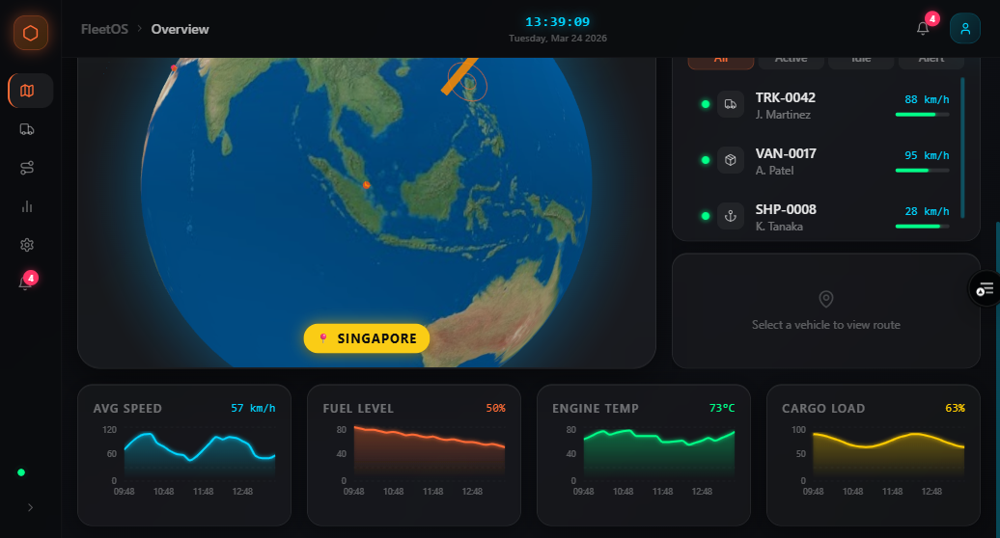

# FleetOS — Logistics Command Dashboard

A modern, futuristic logistics fleet management dashboard built with Next.js 14, featuring an interactive 3D globe, real-time telemetry charts, and a sleek dark-mode glassmorphism UI.

---

## Preview



> Dark mode interface with interactive 3D globe showing live fleet routes, neon orange arcs, glassmorphism panels, and real-time telemetry. Click the yellow **📍 Singapore** button to zoom the globe to Singapore.

---

## Features

- **Interactive 3D Globe** — WebGL globe with animated glowing orange route arcs between global logistics hubs, pulsing vehicle position rings, and neon blue atmosphere
- **Live Fleet Panel** — Vehicle list with real-time status dots (active/idle/maintenance/offline), fuel bars, and selectable route details
- **KPI Cards** — Glassmorphism stat cards for Active Routes, Fleet Size, On-Time Rate, and Alerts — with trend indicators
- **Telemetry Charts** — 4 neon area charts (Speed, Fuel, Engine Temp, Cargo Load) with SVG glow effects
- **Collapsible Sidebar** — Animated expand/collapse with icon nav and alert badge
- **Live Clock** — Real-time ticking clock in the header with neon blue glow
- **Dark Mode Design** — SF Pro font stack, translucent glass panels, high-contrast neon accents

---

## Tech Stack

| Layer | Library |
|-------|---------|
| Framework | Next.js 14 (App Router) |
| Language | TypeScript |
| Styling | Tailwind CSS with custom design tokens |
| 3D Globe | react-globe.gl + Three.js |
| Charts | Recharts |
| Animations | Framer Motion |
| Icons | Lucide React |
| Dates | date-fns |

---

## Design System

| Token | Value | Usage |
|-------|-------|-------|
| Neon Orange | `#ff6b35` | Routes, active state, primary accent |
| Neon Blue | `#00d4ff` | Telemetry, clock, info state |
| Status Green | `#00ff88` | Online / on-time |
| Alert Red | `#ff3366` | Critical alerts, offline |
| Background | `#0a0b0e` | Base dark background |
| Glass Panel | `rgba(255,255,255,0.04)` + blur | Card surfaces |

---

## Getting Started

### Prerequisites

- Node.js 18+
- npm

### Install & Run

```bash
# Install dependencies
npm install

# Start development server
npm run dev
```

Open [http://localhost:3000](http://localhost:3000) in your browser.

### Build for Production

```bash
npm run build
npm start
```

---

## Project Structure

```
src/
├── app/
│   ├── layout.tsx          # Root layout with DashboardLayout wrapper
│   ├── page.tsx            # Main dashboard page
│   └── globals.css         # Global styles, glass-panel utilities, CSS variables
├── components/
│   ├── layout/
│   │   ├── Sidebar.tsx     # Collapsible animated sidebar
│   │   ├── Header.tsx      # Header with live clock and alerts
│   │   └── DashboardLayout.tsx
│   ├── globe/
│   │   ├── GlobeMap.tsx    # SSR-safe wrapper (next/dynamic, ssr: false)
│   │   └── GlobeMapInner.tsx  # react-globe.gl WebGL implementation
│   ├── charts/
│   │   ├── TelemetryChart.tsx  # Recharts AreaChart with neon glow
│   │   └── TelemetryRow.tsx    # 4-chart telemetry row
│   ├── cards/
│   │   ├── StatCard.tsx    # Glassmorphism KPI card
│   │   └── KpiRow.tsx      # 4-card KPI grid
│   ├── fleet/
│   │   ├── VehicleRow.tsx  # Individual vehicle row with status + fuel bar
│   │   ├── FleetList.tsx   # Filterable vehicle list
│   │   ├── RouteDetails.tsx  # Selected route details panel
│   │   └── RightPanel.tsx  # Composed right panel
│   └── ui/
│       ├── GlassPanel.tsx  # Reusable glassmorphism container
│       ├── StatusDot.tsx   # Pulsing colored status indicator
│       └── GlowBadge.tsx   # Neon pill badge
├── lib/
│   ├── mockData.ts         # Fleet vehicles, routes, hubs, telemetry data
│   ├── utils.ts            # Formatters, color maps
│   └── cn.ts               # Class name utility
└── types/
    └── index.ts            # TypeScript interfaces
```

---

## Architecture Notes

- **react-globe.gl** requires `ssr: false` via `next/dynamic` — it accesses `window` at import time
- `next.config.mjs` includes `transpilePackages: ["react-globe.gl", "three-globe"]` for Three.js ESM compatibility
- React is pinned to `^18.3.1` — react-globe.gl 2.x is incompatible with React 19
- All design tokens (glow box-shadows, neon colors, keyframes) are defined in `tailwind.config.ts`
- Mock data in `src/lib/mockData.ts` is the single source of truth for all components

---

## License

MIT
