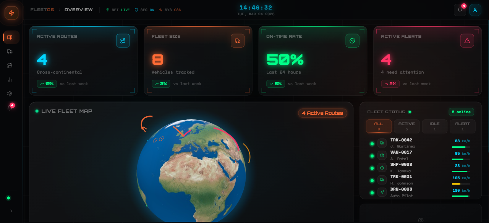

# FleetOS — Logistics Command Dashboard

A futuristic logistics fleet management dashboard built with Next.js 14, featuring an interactive 3D globe, real-time telemetry charts, and a deep-space operations-center aesthetic with Orbitron typography and neon accents.

---

## Preview



> Mission-control UI with Orbitron display font, animated corner-bracket KPI cards, system-status header bar, interactive 3D globe with live route arcs, fleet vehicle panel with filterable status tabs, and neon area telemetry charts.

---

## Features

- **Interactive 3D Globe** — WebGL globe with animated glowing orange route arcs between global logistics hubs, pulsing vehicle position rings, and neon blue atmosphere
- **KPI Cards** — Command-center stat cards with corner bracket decorations, per-accent top-glow lines, hover scan-shimmer animation, and trend badges for Active Routes, Fleet Size, On-Time Rate, and Alerts
- **System Status Header** — Live `NET / SEC / SYS` status indicators, Orbitron breadcrumb, and monospace ticking clock with cyan glow
- **Fleet Status Panel** — Filterable vehicle list (`ALL / ACTIVE / IDLE / ALERT`) with per-filter counts, Space Mono vehicle IDs, speed readouts, and animated fuel bars
- **Route Details** — Animated progress bar, origin → destination with ETA and distance
- **Live Telemetry** — 4 neon area charts (Speed, Fuel, Engine Temp, Cargo Load) with large Orbitron value displays and per-chart accent lines
- **Collapsible Sidebar** — Animated expand/collapse, glowing active left-border, pulse-ring logo, and `SYS ONLINE` indicator
- **Ambient Background** — Subtle grid mesh overlay with orange and cyan radial glow orbs for depth

---

## Tech Stack

| Layer | Library |
|-------|---------|
| Framework | Next.js 14 (App Router) |
| Language | TypeScript |
| Styling | Tailwind CSS + CSS custom properties |
| Typography | Orbitron (display) + Space Mono (data) via `next/font/google` |
| 3D Globe | react-globe.gl + Three.js |
| Charts | Recharts |
| Animations | Framer Motion |
| Icons | Lucide React |
| Dates | date-fns |

---

## Design System

| Token | Value | Usage |
|-------|-------|-------|
| Neon Orange | `#ff6b35` | Routes, active state, primary accent |
| Neon Blue | `#00d4ff` | Telemetry clock, info, speed readouts |
| Status Green | `#00ff88` | Online / on-time |
| Alert Red | `#ff3366` | Critical alerts, offline |
| Caution Yellow | `#ffcc00` | Cargo load, delayed status |
| Background | `#060709` | Deep space base |
| Glass Panel | `rgba(255,255,255,0.04)` + blur(24px) | Card surfaces |
| Display Font | Orbitron 400–900 | Labels, KPI values, nav |
| Data Font | Space Mono 400/700 | Clock, vehicle IDs, readouts |

---

## Getting Started

### Prerequisites

- Node.js 18+
- npm

### Install & Run

```bash
# Install dependencies
npm install

# Start development server
npm run dev
```

Open [http://localhost:3000](http://localhost:3000) in your browser.

### Build for Production

```bash
npm run build
npm start
```

---

## Project Structure

```
src/
├── app/
│   ├── layout.tsx          # Root layout — Orbitron + Space Mono fonts, DashboardLayout
│   ├── page.tsx            # Main dashboard page
│   └── globals.css         # Design tokens, keyframe animations, utility classes
├── components/
│   ├── layout/
│   │   ├── DashboardLayout.tsx  # Ambient glow orbs + grid background
│   │   ├── Sidebar.tsx          # Collapsible sidebar with glow active states
│   │   └── Header.tsx           # Command bar with system status + live clock
│   ├── globe/
│   │   ├── GlobeMap.tsx         # SSR-safe wrapper (next/dynamic, ssr: false)
│   │   └── GlobeMapInner.tsx    # react-globe.gl WebGL implementation
│   ├── charts/
│   │   ├── TelemetryChart.tsx   # Recharts AreaChart with Orbitron value display
│   │   └── TelemetryRow.tsx     # 4-chart telemetry row with section header
│   ├── cards/
│   │   ├── StatCard.tsx         # KPI card with corner brackets + accent line
│   │   └── KpiRow.tsx           # 4-card KPI grid
│   ├── fleet/
│   │   ├── VehicleRow.tsx       # Vehicle row with status dot + fuel bar
│   │   ├── FleetList.tsx        # Filterable vehicle list with count badges
│   │   ├── RouteDetails.tsx     # Selected route details with progress bar
│   │   └── RightPanel.tsx       # Composed right panel
│   └── ui/
│       ├── GlassPanel.tsx       # Reusable glassmorphism container
│       ├── StatusDot.tsx        # Pulsing colored status indicator
│       └── GlowBadge.tsx        # Neon pill badge
├── lib/
│   ├── mockData.ts         # Fleet vehicles, routes, hubs, telemetry data
│   ├── utils.ts            # Formatters, color maps
│   └── cn.ts               # Class name utility
└── types/
    └── index.ts            # TypeScript interfaces
```

---

## Architecture Notes

- **react-globe.gl** requires `ssr: false` via `next/dynamic` — it accesses `window` at import time
- `next.config.mjs` includes `transpilePackages: ["react-globe.gl", "three-globe"]` for Three.js ESM compatibility
- React is pinned to `^18.3.1` — react-globe.gl 2.x is incompatible with React 19
- All design tokens and keyframe animations are defined in `globals.css` using CSS custom properties
- Mock data in `src/lib/mockData.ts` is the single source of truth for all components

---

## License

MIT
